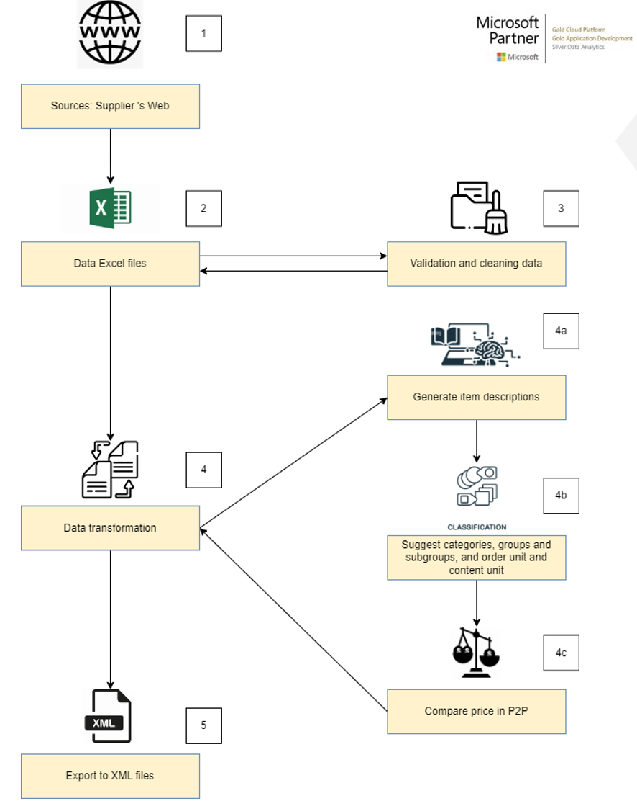

# Introduction 
Built a system to classify and categorize product information extracted from web crawling efforts. The project aimed to automate data organization and improve accuracy in product categorization for better decision-making and operational efficiency.

# Step By Step

1. Crawl data from the supplier‘s website to get all necessary information on products including prices and images.
2. Store all data as dataframes in Python or Excel files to prepare for new data generation.
3. Validate and clean data to fix incorrect records or format.
4. Transform data:
  * Generate item descriptions based on existed data with OpenAI models or Machine Learning algorithms.
  * Classify values for some fields: categories, groups, subgroups, order unit and content unit  for all products based on Machine Learning classification algorithms.
  * Automatically compare item prices  in P2P based on statistical models.
5. Export to XML files with file name following this format: XXX YYYYYY DDMMYYYY.xml

# Result

# Contribute
* **An Pham** - Data Engineer - [AnNePDHA](https://github.com/AnNePDHA)
  * Conducted web crawling using Selenium to collect product data from multiple sources, ensuring comprehensive and up-to-date datasets
  * Utilized Fuzzy Matching techniques to handle inconsistencies in product names and descriptions, enhancing data matching precision
  * Applied Azure OpenAI Chatbot Model in Python to classify and categorize product data, improving accuracy and reducing manual effort.
  * Generated mapping files and provided technical guidance to the development team on mapping standards, ensuring consistency and scalability in the system.
